<div align="center">

# Lead Agent Platform

### A tenant-safe AI lead-to-booking platform for appointment businesses

[](https://github.com/mufazzalshokh/lead-agent-platform/actions/workflows/ci.yml)


**Uzbek · Russian · English** · **Modular monolith** · **Human-controlled booking**

</div>

Lead Agent Platform is a production-oriented SaaS foundation for turning inbound
customer conversations into qualified leads and safe booking requests. The initial
focus is dental and aesthetic clinics, while the domain and integration boundaries are
designed for other high-value appointment businesses.

The AI interprets language and proposes structured actions. Deterministic application
policy remains responsible for authorization, tenant identity, business facts, state
transitions, and side effects.

> [!IMPORTANT]
> This repository is under active development and is not production-ready. The core
> architecture, contracts, domain kernel, PostgreSQL foundation, and tenant-safe
> persistence are complete. S6 authentication and RBAC architecture is frozen and is
> the next implementation stage. Customer-facing AI and provider integrations remain
> later roadmap work.

## Current progress

| Milestone                    | Status | Delivered                                                                                         |
| ---------------------------- | :----: | ------------------------------------------------------------------------------------------------- |
| S0 — Architecture            |   ✅   | Audited product, security, data, AI, reliability, and delivery architecture                       |
| S1 — Workspace baseline      |   ✅   | Reproducible pnpm monorepo, CI gate, strict TypeScript, lint, and boundaries                      |
| S2 — Canonical contracts     |   ✅   | Runtime schemas, errors, pagination, events, channel contracts, and drift protection              |
| S3 — Pure domain kernel      |   ✅   | Lead, Conversation, Handoff, AppointmentRequest, and cross-machine workflows                      |
| S4 — Database foundation     |   ✅   | PostgreSQL 17 schema with 47 production tables and explicit migrations                            |
| S5 — Tenant-safe persistence |   ✅   | FORCE RLS, tenant sessions, repositories, CAS, atomic audit/outbox writes, and inbound resolver   |
| S6 — Staff identity and RBAC |   🟡   | Architecture frozen; Auth0, sessions, MFA, permissions, invitations, and location scopes are next |
| S7+ — Product workflows      |   ⏳   | Knowledge APIs, messaging, AI orchestration, booking operations, UX, and launch readiness         |

## What is already implemented

- Versioned runtime contracts with compatibility snapshots and drift checks.
- Pure TypeScript domain state machines with deterministic transitions and typed errors.
- PostgreSQL 17 and Drizzle schema covering tenant configuration, contacts, leads,
  conversations, appointments, handoffs, notifications, reliability, audit, privacy,
  analytics, and AI provenance.
- Thirteen explicit migrations (`0000` through `0012`) with fresh-install, upgrade,
  rerun, structural, and hostile-tenant verification.
- FORCE RLS across the tenant table manifest with a non-owner, `NOBYPASSRLS` runtime
  role and transaction-local tenant context.
- Immutable tenant database sessions, tenant-qualified repositories, active-record
  uniqueness, expected-version CAS, and atomic history/audit/outbox persistence.
- A narrow, fail-closed pre-tenant inbound route resolver without general table access.
- Web, API, and worker composition shells with a repository-wide CI verification gate.

## Safety model

The project treats AI output, channel payloads, browser input, provider responses, and
business knowledge text as untrusted data.

- AI cannot authorize users, select a tenant, write SQL, invent prices or availability,
  or directly mutate protected state.
- Structured tenant data is authoritative; missing facts produce a safe response or
  human handoff.
- Every tenant-owned operation is explicitly scoped and protected by PostgreSQL RLS.
- Domain state, audit evidence, and outbox intent commit atomically where required.
- Duplicate, delayed, retried, and reordered webhook deliveries are expected.
- Staff acceptance is not a confirmed booking; customer confirmation is still required.
- V1 performs no autonomous external-calendar write and provides no medical diagnosis.

## Target request flow

```mermaid
flowchart LR
    A[Inbound message] --> B[Resolve channel and tenant]
    B --> C[Deduplicate and load state]
    C --> D[Load authoritative facts]
    D --> E[AI structured decision]
    E --> F[Schema and policy validation]
    F --> G[Deterministic domain action]
    G --> H[(PostgreSQL transaction)]
    H --> I[Outbox and worker]
    I --> J[Response or staff handoff]
```



## Technology

| Area           | Stack                                                                          |
| -------------- | ------------------------------------------------------------------------------ |
| Runtime        | Node.js 24, TypeScript 6, pnpm workspaces                                      |
| Web            | Next.js 16, React 19                                                           |
| API            | Fastify 5                                                                      |
| Database       | PostgreSQL 17, Drizzle ORM and explicit SQL migrations                         |
| Contracts      | TypeBox runtime schemas and versioned compatibility snapshots                  |
| Testing        | Vitest, real PostgreSQL integration tests, hostile-tenant security tests       |
| Authentication | Auth0 OIDC Authorization Code + PKCE architecture; implementation begins in S6 |

## Repository map

```text
apps/
  web/             Next.js staff and widget composition shell
  api/             Fastify HTTP composition shell
  worker/          Background-worker composition shell
packages/
  contracts/       Canonical runtime schemas and public event contracts
  domain/          Pure values, state machines, and cross-machine workflows
  database/        Drizzle schema, SQL migrations, RLS runtime, and repositories
  application/     Application orchestration boundary
  integrations/    External provider boundary
  ai/              Provider-independent AI boundary
  security/        Authentication and security boundary
  observability/   Telemetry boundary
  config/          Validated configuration
  testing/         Shared deterministic test support
  ui/              Shared presentation boundary
docs/architecture/ Accepted architecture, ADRs, risks, and implementation roadmap
tests/             Contract, domain, database, security, and workspace regression suites
```

## Getting started

### Prerequisites

- Node.js `24.14.0` (see `.node-version`)
- Corepack
- pnpm `11.24.0` (declared in `packageManager`)
- PostgreSQL 17 only when running the database integration suite

```sh
corepack enable
pnpm install --frozen-lockfile
pnpm dev
```

Development starts the web app at `http://localhost:3000`, the API at
`http://localhost:3001`, and the worker shell. The API's optional `HOST` and `PORT`
settings are documented in `.env.example`.

## Verification

```sh
pnpm format:check       # formatting
pnpm lint               # zero-warning lint
pnpm boundaries:check  # dependency direction and cycle rules
pnpm contracts:check   # public contract compatibility
pnpm typecheck          # strict workspace type checking
pnpm test:run           # deterministic repository tests
pnpm build              # all packages and applications
pnpm ci:verify          # complete repository gate
```

`pnpm test:database` requires a fresh, disposable PostgreSQL 17 database identified by
`TEST_DATABASE_URL`. The harness rejects a database that is not explicitly test-named;
never point it at shared, staging, or production data.

## Architecture and roadmap

The architecture package is the source of truth for product and engineering decisions:

- [Architecture index](docs/architecture/README.md)
- [System architecture](docs/architecture/02-system-architecture.md)
- [Domain model and state machines](docs/architecture/03-domain-and-state-machines.md)
- [PostgreSQL data model](docs/architecture/04-data-model.md)
- [Tenancy, security, and privacy](docs/architecture/07-tenancy-security-privacy.md)
- [Test strategy](docs/architecture/09-test-strategy.md)
- [ADRs, roadmap, and risks](docs/architecture/11-adrs-roadmap-risks.md)

Repository-wide engineering rules are defined in [AGENTS.md](AGENTS.md).

## Product direction

The first complete vertical slice will support secure widget and Telegram intake,
authoritative multilingual FAQ and pricing responses, deterministic qualification,
human handoff, staff-controlled appointment requests, and explicit customer
confirmation. Instagram, WhatsApp, external calendars, CRM synchronization, billing,
and additional verticals remain behind reviewed integration boundaries.
