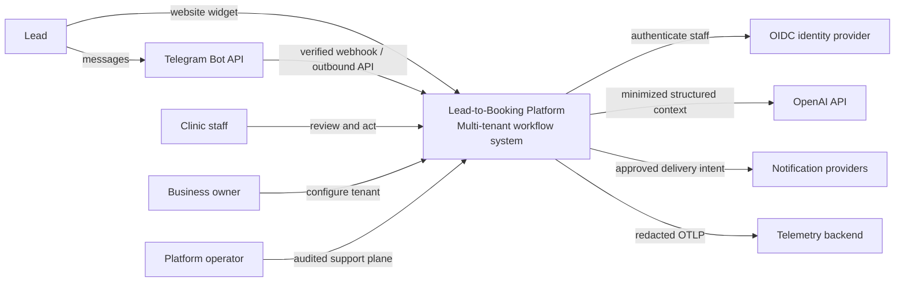
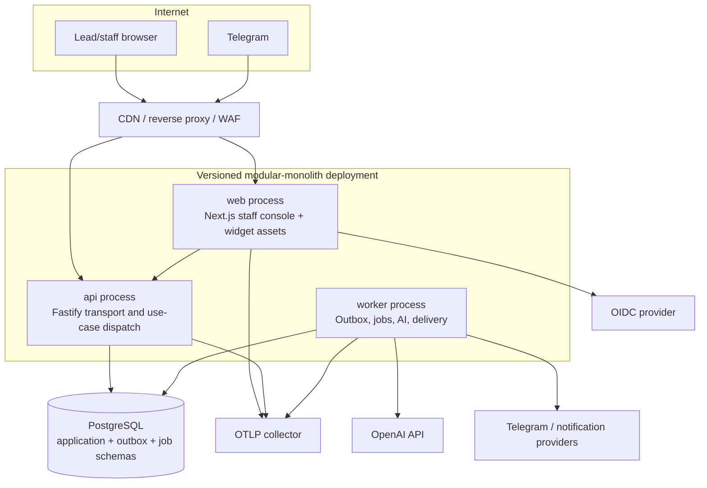
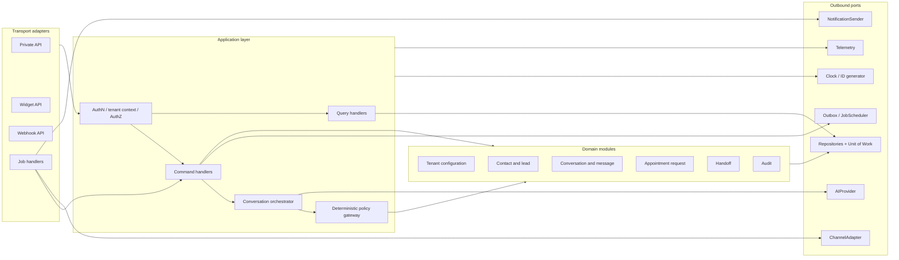
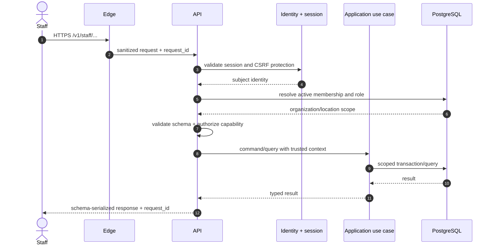
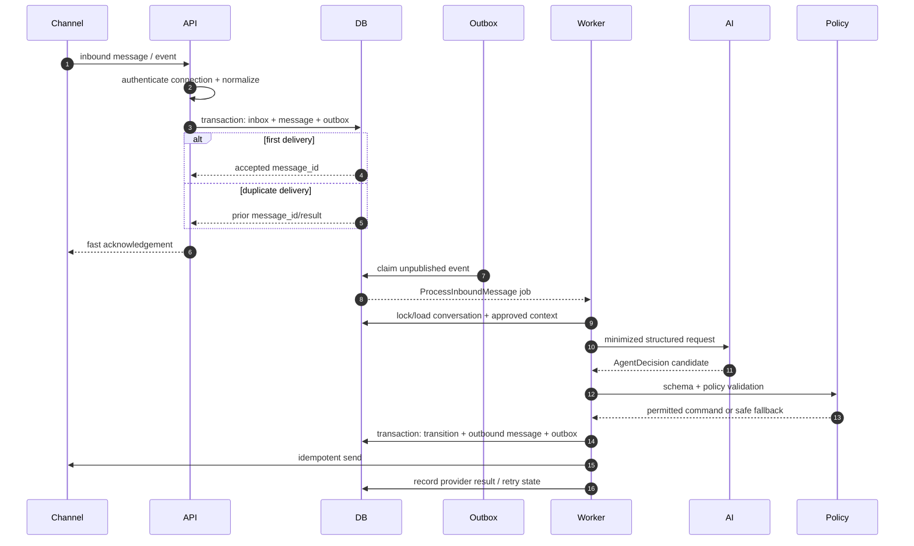
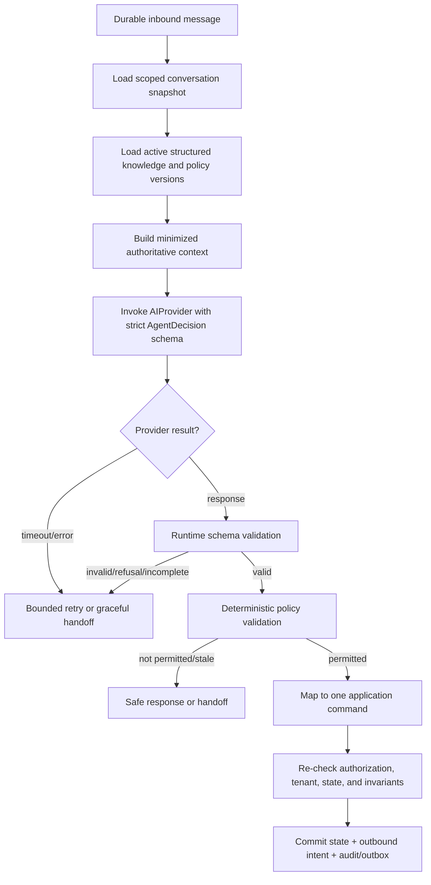
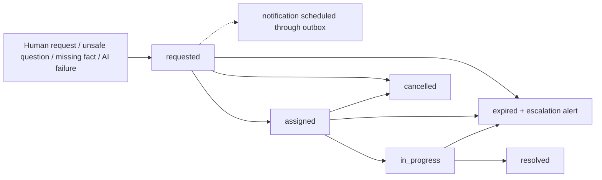
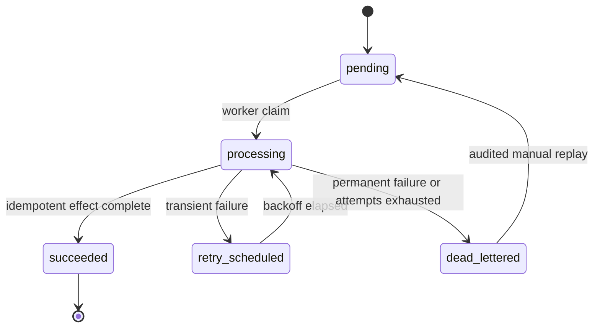

# System Architecture

Status: Stage 0 normative specification

Last reviewed: 2026-08-30

## 1. Purpose and architectural boundary

The system is a multi-tenant workflow product that converts inbound messages into
qualified leads and human-confirmed booking outcomes. It is not a general-purpose
chatbot and it is not a calendar authority.

V1 is a modular monolith deployed as three independently scalable processes:

- `web`: staff console and embeddable widget assets;
- `api`: private, public-widget, and integration HTTP entry points;
- `worker`: asynchronous AI orchestration, message delivery, notifications,
  analytics projection, and maintenance work.

All three processes are built from the same versioned repository and share domain
and contract packages. They do not share in-memory state. PostgreSQL is the
durable system of record.

## 2. Architecture principles

1. Tenant identity is resolved and authorized before tenant-owned data is read.
2. The domain model, not the model provider or transport, owns state transitions.
3. Structured business records are the sole source for services, prices, hours,
   policies, and any future availability information.
4. AI output is untrusted interpretation. It is schema-validated and then
   policy-validated before an application command may run.
5. A database transaction commits domain state and outbox intent together.
6. External delivery is at-least-once; consumers and effects are idempotent.
7. Channel-specific behavior stops at an adapter boundary.
8. PII is minimized, encrypted where appropriate, redacted from telemetry, and
   deleted by policy.
9. Operational simplicity is a V1 feature: no microservices, event broker, vector
   database, or autonomous calendar writes.
10. Scale-out must not weaken tenant isolation or deterministic behavior.

## 3. Technology baseline

| Concern | Stage 0 decision | Rationale |
|---|---|---|
| Language/runtime | TypeScript on Node.js 24 LTS | One strongly typed language across web, API, worker, and contracts; production runtime remains on an LTS line. |
| Workspace | pnpm workspaces | Deterministic lockfile and package boundaries without requiring a service split. |
| Web | Next.js App Router | Staff console, tenant-aware server rendering where useful, and static widget distribution. |
| API | Fastify REST | JSON-Schema-first request/response validation, bounded plugins, and efficient Node HTTP handling. |
| Database | PostgreSQL | Transactions, constraints, JSONB for bounded metadata, row-level security, and queue/outbox access patterns. |
| Data access | Drizzle ORM plus reviewed SQL migrations | Strongly typed query composition while preserving explicit SQL and migration control. |
| Contracts | JSON Schema as wire source of truth, with generated/inferred TypeScript types | Runtime validation and OpenAPI/AI schema reuse without hand-maintained duplicate interfaces. |
| Jobs | Transactional outbox plus pg-boss-backed worker queues | PostgreSQL-backed durability avoids a second stateful broker in V1; all handlers remain idempotent. |
| AI | OpenAI Responses API behind `AIProvider`; `store: false`; strict structured output | Application owns state and retention; provider output remains a proposal, never authority. |
| Authentication | OIDC-compatible staff identity plus application-owned membership/RBAC | Identity proof is separated from tenant authorization. |
| Telemetry | OpenTelemetry APIs and OTLP export | Vendor-neutral logs, metrics, and traces with centralized redaction. |
| Deployment | OCI containers plus managed PostgreSQL | Portable separation of web/API/worker and independent horizontal scaling. |

Production dependencies and exact versions are pinned and security-reviewed in
Stage 1. Model selection is configuration backed by multilingual eval evidence;
production must use a pinned supported model identifier rather than a floating
`latest` alias.

## 4. System context



### Trust boundaries

- Internet inputs: browser requests, widget messages, Telegram webhooks, and OIDC
  callbacks are untrusted.
- Tenant boundary: no request-supplied `organization_id` is accepted as authority.
- Provider boundary: OpenAI, messaging, identity, and notification responses are
  validated as untrusted external data.
- Operations boundary: platform support access is distinct from tenant membership
  and requires an audited, time-bounded elevation path.
- Database boundary: the runtime role is not table owner, cannot bypass row-level
  security, and has only required privileges.

## 5. Container architecture



### Container responsibilities

#### Web

- serves the staff application and static widget bundle;
- completes staff OIDC browser flows and holds only secure session references;
- calls the private API rather than querying the database;
- applies presentation authorization for usability, never as the enforcement layer;
- does not contain business transition logic.

#### API

- exposes `/v1/staff` private resources, `/v1/widget` anonymous resources, and
  `/v1/webhooks` provider endpoints;
- authenticates or validates the entry-point credential;
- resolves tenant context server-side;
- validates input and output contracts;
- authorizes use cases and invokes application services;
- performs short deterministic transactions;
- returns before slow AI/provider work when the channel permits asynchronous work.

#### Worker

- claims outbox records and durable jobs;
- constructs minimized AI context and invokes the provider adapter;
- validates `AgentDecision` and dispatches allowed domain commands;
- sends channel replies and staff/customer notifications;
- projects analytics and executes retention/deletion maintenance;
- retries transient failures with bounded backoff and dead-letter handling.

#### PostgreSQL

- stores authoritative tenant configuration and workflow state;
- enforces keys, uniqueness, check constraints, and state-independent invariants;
- applies row-level security as defense in depth;
- stores outbox, inbox/idempotency records, and the V1 job queue;
- is backed up independently of application deploys.

## 6. Component architecture



### Dependency rules

- `domain` imports only domain-local primitives and stable contracts.
- `application` imports `domain` and port interfaces, never concrete providers.
- transport adapters import application use cases and contract schemas.
- infrastructure adapters implement ports and may import vendor SDKs.
- UI imports public/private client contracts, never domain repositories.
- channel and AI adapters cannot invoke repositories except through an application
  use case supplied to them.
- no package imports from an app entry point.
- cyclic package dependencies fail CI.

## 7. Canonical request context

Every accepted operation carries an immutable context:

| Field | Source | Rule |
|---|---|---|
| `request_id` | edge/API generated or validated inbound trace header | Always returned; untrusted inbound value is length/format constrained. |
| `correlation_id` | existing workflow correlation or generated | Propagates through outbox and jobs. |
| `actor_type` / `actor_id` | verified staff session, widget session, integration identity, or system job | Never inferred from body data. |
| `organization_id` | membership lookup, widget key lookup, channel-connection lookup, or stored job | Never trusted from an anonymous body. |
| `location_scope` | authorized membership and request resource | Intersected, never widened, by requested filters. |
| `channel_connection_id` | verified widget session or webhook route/secret | Required for channel operations. |
| `locale` | validated user preference or detected presentation hint | Does not change authorization or domain rules. |
| `now` | injected UTC clock | Business-local calculations explicitly use location timezone. |

Repository calls require a tenant context type; an unscoped tenant-owned repository
method is prohibited. Cross-tenant platform jobs use a separate audited control
path and process one explicit organization at a time.

## 8. Request lifecycles

### 8.1 Staff/private request



An ID belonging to another tenant is returned as `404` where existence disclosure
would create an IDOR oracle. Permission failures within the already proven tenant
return `403`.

### 8.2 Anonymous widget request

1. The embed script presents a public, rotatable widget key.
2. The API resolves that key to an active organization, allowed location(s), and
   configured domain allowlist; the body cannot select a different tenant.
3. Origin/referer checks are risk signals and embed controls, not sole authentication.
4. A rate-limited bootstrap endpoint issues a short-lived, signed widget session
   bound to the connection and anonymous conversation nonce.
5. The message endpoint validates that token, request size, sequence/idempotency key,
   and content contract.
6. The API transaction records the inbound message and an outbox event, then returns
   an acknowledgement or an already-computed duplicate result.
7. The client receives the reply by bounded polling or a scoped streaming channel;
   reconnecting does not create a new message.

### 8.3 Integration/webhook request

1. Read the raw bounded body before parsing where provider signature verification
   requires exact bytes.
2. Resolve a candidate connection only from a non-secret route identifier.
3. Verify provider signature/secret and replay timestamp using constant-time
   comparison where applicable.
4. Parse and validate a provider-specific schema; reject oversized or unsupported
   payloads.
5. Normalize to `InboundChannelMessage`.
6. In one transaction, insert an inbox receipt under a provider-scoped unique key,
   persist the canonical message if new, and write the outbox event.
7. Return the provider-required success status quickly. Duplicate valid deliveries
   return success without replaying effects.

## 9. Message lifecycle



Per-conversation processing is serialized using a short advisory lock or row lock
at the command boundary. The lock is not held during an AI network request. Instead,
the worker records the conversation version used for the AI run; before applying the
decision it verifies that version. A mismatch makes the decision stale and causes a
bounded re-plan or safe handoff, never blind application.

## 10. AI lifecycle



The model is not given database, calendar, messaging, billing, or arbitrary network
tools in V1. Tool-like options in `AgentDecision` are a closed application-owned
enum. Only the policy gateway can map one to an internal command.

Conversation history is stored by the application and sent as a bounded, redacted
window plus deterministic summary. The OpenAI request uses `store: false`; provider
response IDs may be kept as operational metadata only if retention policy permits.

## 11. Booking lifecycle

The detailed Stage 0 requirement controls the durable workflow:

```mermaid
sequenceDiagram
  autonumber
  actor Lead
  participant Channel
  participant App
  participant Staff
  participant DB
  participant Worker

  Lead->>Channel: preferred date/time and service
  Channel->>App: create appointment request
  App->>DB: requested + staff notification outbox
  App-->>Lead: request received; not yet booked
  App-->>Staff: review request
  alt staff rejects
    Staff->>App: reject with public-safe reason/next step
    App->>DB: rejected + customer notification outbox
    App-->>Lead: request not accepted / alternatives
  else staff accepts proposed details
    Staff->>App: accept exact location/service/time
    App->>DB: staff_accepted + prepare-confirmation outbox
    DB-->>Worker: durable preparation work
    Worker->>DB: confirmation capability + delivery intent + awaiting_customer_confirmation
    Worker-->>Channel: offer exact staff-approved booking details
    Channel-->>Lead: offer; confirmation required
    alt customer confirms in bound channel/session
      Lead->>Channel: confirm current offer
      Channel->>App: verified confirmation command
      App->>DB: confirmed + customer evidence
      App-->>Staff: customer confirmed
    else staff records an external customer act
      Staff->>App: attest phone/in-person confirmation
      App->>DB: confirmed + audited external evidence
    else customer declines or offer expires
      Lead->>App: decline or no response
      App->>DB: cancelled or expired
    end
  end
```

`staff_accepted` and `awaiting_customer_confirmation` are not presented as a
confirmed booking. The deterministic transition between them occurs only after a
current confirmation capability and durable delivery intent are committed. The
interval may be brief, but it is observable and recoverable. If product research
later decides that customer acknowledgement is unnecessary, that is a versioned
state-machine/contract change, not a wording change.

No V1 component writes an external calendar. A future `CalendarProvider` may read
candidate availability and, only after a separately approved stage, commit a booking
under application-controlled idempotency and policy.

## 12. Human-handoff lifecycle



- Handoff creation and the customer acknowledgement are one transaction.
- One active handoff per conversation is enforced by a partial unique index.
- AI auto-replies are paused while a handoff is assigned/in progress unless an
  explicit policy permits a non-substantive acknowledgement.
- Staff resolution records an outcome and audit event; it does not silently erase
  the triggering message.
- Unacknowledged handoffs breach a configurable SLA and escalate to another staff
  notification route.

## 13. Async-job lifecycle



### Outbox dispatch

1. A use-case transaction writes the aggregate change, domain event, and outbox row.
2. A dispatcher claims rows with `FOR UPDATE SKIP LOCKED`, marks a lease, and creates
   a named durable job using the outbox ID as the deduplication key.
3. After durable job creation, it records `published_at`; a crash at any boundary is
   safe because both dispatch and job handling are idempotent.
4. A job handler records attempt metadata, invokes the provider with an effect-level
   idempotency key where supported, and persists the outcome.
5. Exhausted work moves to a dead-letter state and alerts with redacted context.

The queue is delivery infrastructure, not a second business source of truth. A job
contains IDs and immutable version references, not full PII-rich aggregates.

## 14. Transactional boundaries and concurrency

| Operation | Atomic boundary | Concurrency/idempotency rule |
|---|---|---|
| Receive channel message | inbox receipt + canonical message + conversation touch + outbox | Unique `(channel_connection_id, external_message_id)`; widget uses `(widget_session_id, client_message_id)`. |
| Apply AI decision | state-version check + domain transition + AI-run outcome + outbound message + outbox | Optimistic `conversation.version`; stale decisions never apply. |
| Create appointment request | request + lead update + audit + staff notification outbox | Client/source idempotency key and at most one active equivalent request policy. |
| Staff decision | appointment transition + decision metadata + customer notification outbox | Expected version and transition precondition. |
| Customer confirmation | appointment transition + audit + staff notification outbox | Single-use scoped confirmation capability plus expected version. |
| Handoff | handoff + conversation mode + acknowledgement + notification outbox | Partial unique active-handoff constraint. |
| Tenant configuration publish | new immutable/versioned knowledge snapshot + audit | Draft validation then atomic activation; active readers see one version. |

Network calls do not occur inside database transactions. Transaction retry is
bounded to recognized serialization/deadlock failures and re-runs a pure command
against freshly loaded state.

## 15. Scalability model

### V1 scale assumptions

Initial capacity planning uses explicit assumptions, not a claim of measured limits:

- up to 100 active organizations;
- up to 1,000 concurrent conversations;
- peak 50 inbound messages/second platform-wide;
- 10 million messages/year before archival;
- all webhook/widget acceptance and ordinary staff API request paths complete
  without an external AI provider call; substantive AI work is asynchronous;
- AI and delivery work can queue briefly while preserving message order per
  conversation.

These are sizing inputs to load tests and cost models, not contractual limits.

### Horizontal scaling

- Web and API containers are stateless and scale behind the edge proxy.
- Workers scale by queue name and concurrency; per-conversation version checks avoid
  cross-worker state corruption.
- Database connections use bounded pools and, when needed, a managed pooler.
- Read replicas may later serve tenant-scoped analytical/read workloads, never
  authorization decisions or read-after-write paths.
- Large tenant tables are indexed with `organization_id` leading common access
  patterns. Time-based partitioning is introduced only from measured table/index
  pressure, not preemptively.
- Analytics starts as append-only events plus asynchronous projections in the same
  database. A warehouse export adapter is a later seam.

### Scale triggers

Revisit the modular deployment—not necessarily the codebase boundary—when measured
evidence shows one of these conditions:

- worker workloads cannot meet SLOs without exhausting database connections;
- queue/outbox traffic materially interferes with transactional workloads;
- a bounded context needs a different availability, compliance, or scaling profile;
- a provider adapter requires independent release isolation;
- analytics retention/query volume compromises the primary database.

Any extraction preserves versioned contracts, outbox semantics, tenant context, and
end-to-end trace propagation.

## 16. Availability and graceful degradation

| Dependency failure | Customer-safe behavior | Recovery |
|---|---|---|
| OpenAI timeout/outage | Persist message, acknowledge delay, open/offer handoff; never fabricate an answer. | Circuit breaker, bounded retry, replay pending conversation version. |
| Telegram send failure | Preserve outbound intent and show delivery pending to staff. | Retry with same logical message ID; dead-letter and alert. |
| Notification provider failure | Booking request remains durable and visible in the authoritative in-app staff inbox. | Retry configured optional adapters; alert on SLA risk without treating delivery as acceptance. |
| PostgreSQL unavailable | Readiness fails; mutation endpoints return generic retryable error and do not claim acceptance. | Platform restart/reconnect after managed failover; reconcile inbox/provider redelivery. |
| OIDC unavailable | Existing valid sessions continue only within their bounded lifetime; new login fails closed. | Provider recovery; no bypass login. |
| Telemetry backend unavailable | Business operations continue with bounded local buffering/drop policy that never accumulates PII. | Export resumes; emit dropped-telemetry counter. |
| Worker backlog | API continues durable ingestion until explicit queue-depth/load-shed threshold. | Autoscale workers, prioritize handoff/booking delivery, alert. |

## 17. Edge-case policy

| Edge case | Deterministic treatment |
|---|---|
| Duplicate or reordered webhook | Inbox uniqueness suppresses duplicates; provider timestamp/sequence is recorded, but domain state/version decides applicability. |
| Lead sends multiple messages rapidly | Store all; serialize decisions per conversation snapshot; combine only via explicit debounce policy that never drops content. |
| Same phone across channels | Normalize and suggest a match; do not merge contacts automatically without a deterministic confidence/verification rule. |
| Price missing | State that staff confirmation is required and create/offer handoff; never infer from similar services. |
| Price range configured | Quote the exact range/currency and qualifying conditions from the active record. |
| Requested slot outside opening hours | Record preference; explain configured hours; never claim availability. |
| Timezone or daylight-saving ambiguity | Ask for clarification or use explicit location timezone and return the interpreted local timestamp for confirmation. |
| Staff edits service after request | Existing request retains a snapshot/version; material changes require a new customer confirmation. |
| Customer confirms expired offer | Reject transition and create a new request/review path; do not resurrect silently. |
| Tenant/configuration disabled mid-conversation | Stop AI actions, preserve audit state, and return configured unavailable/handoff response. |
| Knowledge changes during AI run | Version mismatch blocks decision application and triggers bounded re-plan. |
| Unsupported language | Detect as a presentation hint, ask user to select supported language or hand off. |
| Medical/diagnostic request | Give no diagnosis; use approved administrative safety wording and hand off where configured. |
| Malicious knowledge text | Store as untrusted content, validate administrative fields, delimit it in prompts, and never convert it into tool/policy instructions. |

## 18. Architecture fitness functions

CI must eventually enforce these machine-checkable properties:

- dependency-boundary tests reject domain imports from infrastructure/apps;
- every tenant-owned table is listed in an RLS coverage test;
- every tenant repository method requires `TenantContext`;
- OpenAPI and JSON Schema artifacts are generated from the contract source and
  checked for drift;
- state-machine transition tables are exhaustively tested, including all invalid
  pairs;
- every externally triggered command declares an idempotency strategy;
- no outbound provider call exists in a database transaction path;
- logs fail redaction tests for seeded PII canaries;
- AI decisions cannot name undeclared actions or arbitrary tools;
- no calendar write capability is present in V1 provider permissions;
- Mermaid and internal documentation links validate in CI.

## 19. Source notes

The baseline is informed by current primary documentation:

- [Node.js release status](https://nodejs.org/en/about/previous-releases) identifies
  Node.js 24 as an LTS line at this review date.
- [Fastify validation and serialization](https://fastify.dev/docs/latest/Reference/Validation-and-Serialization/)
  documents its JSON-Schema-first boundary validation model and cautions against
  treating user-provided schemas as trusted code.
- [PostgreSQL row security](https://www.postgresql.org/docs/17/ddl-rowsecurity.html)
  documents default-deny behavior when RLS is enabled without an applicable policy,
  as well as owner and `BYPASSRLS` caveats addressed by the role design.
- [Drizzle transactions](https://orm.drizzle.team/docs/transactions) establishes the
  transaction primitive expected by the repository/unit-of-work adapter.
- [OpenAI Responses API](https://developers.openai.com/api/reference/cli/resources/responses/methods/create)
  documents structured JSON responses, tools, `store`, response failure states, and
  usage metadata. The architecture permits no direct model-side business effects.
- [OpenAI data controls](https://developers.openai.com/api/docs/guides/your-data)
  informs the `store: false`, application-owned conversation state, data-minimization,
  and deployment due-diligence requirements.
