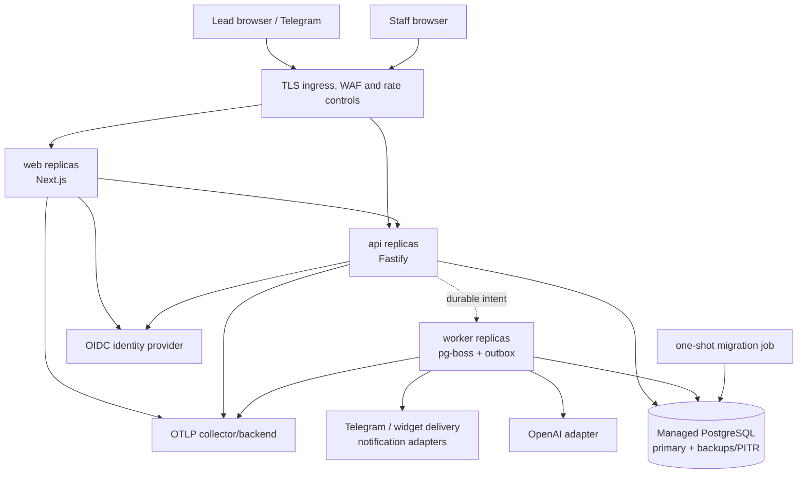

# Deployment and Repository Architecture

## Deployment goals

The system is a TypeScript modular monolith delivered as three independently scalable processes from one repository and one release:

- `web`: Next.js staff/control-plane UI and public widget surface;
- `api`: Fastify REST endpoints for staff, widget, and verified integrations;
- `worker`: pg-boss/outbox processing, AI orchestration, outbound delivery, analytics projection, and maintenance.

All use Node.js 24 LTS as the implementation baseline and a single `pnpm` lockfile. PostgreSQL is the only required stateful platform component in V1. Images are cloud-neutral OCI containers. A managed PostgreSQL service, TLS ingress/load balancer, secret manager, and OTLP-compatible telemetry backend are deployment capabilities, not dependencies embedded in domain code.

## Deployment topology



The dotted API-to-worker edge represents coordination through PostgreSQL, never an in-memory call. API and web replicas are stateless except for bounded process-local caches that cannot carry authority. Sessions, tenant membership, idempotency, conversations, jobs, and rate/quota decisions that affect correctness must survive process replacement.

V1 is one production region with failure-domain redundancy where the selected host supports it. Active-active multi-region writes are excluded until business RPO/RTO and scale justify their consistency cost.

## Environment model

| Environment | Purpose | Data and dependencies | Deployment policy |
| --- | --- | --- | --- |
| Local | Fast feedback and manual development | Local/disposable PostgreSQL, deterministic fake providers by default, synthetic seeds | `pnpm` workspace commands plus container compose; no production credentials |
| Test/CI | Hermetic automated checks | Ephemeral PostgreSQL per job, fake/stub providers; dedicated sandbox only in explicitly marked jobs | Destroy after run; artifacts retained under test-data policy |
| Staging | Release rehearsal, E2E, live-model/provider sandbox, load/resilience checks | Isolated database/account/project, synthetic data, separate domains/bots/keys | Same immutable image/config schema as production; automatic from approved main build |
| Production | Customer traffic | Production-only managed services and secrets; no synthetic staging identities reused | Approval, migration gate, progressive rollout, smoke/telemetry gate, audited rollback |

Environments do not share databases, encryption keys, OIDC clients, bot tokens, webhook secrets, storage, telemetry projects, or network credentials. Production data is never copied to lower environments. Configuration validation fails closed when an environment points at a resource tagged for another environment.

Preview deployments may be added for the web UI, but they use isolated synthetic APIs/data and cannot receive real provider webhooks.

## Local development

The intended local workflow provides:

- a repository-pinned Node major and `pnpm` package manager declaration;
- a compose file for the supported PostgreSQL major and an optional local telemetry collector;
- one command to install, one to migrate/seed synthetic fixtures, one to run the three apps, and one to execute checks;
- deterministic OpenAI, OIDC, Telegram, notification, clock, and ID adapters by default;
- opt-in sandbox/live adapters only when explicitly configured with local secret references;
- separate commands to reset only the named local development database, never a broad filesystem/database target.

Seed data includes multiple tenants with visibly fictional Uzbek, Russian, and English content so tenant and language behavior is exercised during development.

## Configuration and secrets

### Configuration contract

`packages/config` owns a runtime-validated configuration schema. Each app declares the subset it consumes. Unknown/missing/contradictory production settings fail startup with a safe key name and error code, never a secret value. Checked-in `.env.example` files contain names and non-secret examples only.

Configuration categories include environment/release, public origins, database pool and deadlines, OIDC issuer/audience/client references, encryption key references, channel/provider endpoints, OpenAI provider/model alias and deadlines, job concurrency/retry profiles, telemetry exporter, retention controls, feature flags, and budget guardrails.

### Secret handling

- Production secrets reside in the deployment platform's secret manager and are injected at runtime by workload identity or short-lived credentials.
- CI uses GitHub OIDC/workload federation where the target permits it; long-lived cloud credentials are not repository secrets.
- Database credentials are least-privilege and separate for runtime, worker, migration, read-only operations, and break-glass administration as supported.
- Integration tokens stored in PostgreSQL use application-level envelope encryption with a managed key reference, key version, and auditable rotation path.
- Webhook signing secrets support a bounded dual-key rotation window. Verification identifies the key version without logging the signature.
- Public browser configuration is explicitly allowlisted. Server secrets can never be included in Next.js public bundles or source maps.
- Rotation and revocation runbooks cover OIDC client, database, OpenAI, Telegram, webhook, encryption, and telemetry credentials.
- Secret values are filtered from logs, traces, errors, process listings, build arguments, test snapshots, and support exports.

## Build and artifact strategy

`pnpm-lock.yaml` is committed. Dependency ranges may be declared normally, but CI uses the frozen lockfile. Framework/library versions are selected and verified during bootstrap rather than invented in this specification.

Each commit produces:

1. typechecked/tested workspace packages;
2. production bundles for web/API/worker;
3. minimal non-root OCI images with pinned base-image digests, production-only dependencies, a read-only root filesystem where practical, and an init/signal strategy;
4. generated OpenAPI/JSON Schema artifacts checked for drift;
5. a software bill of materials, dependency/container scan results, provenance, and image digest.

Build once and promote the same image digest from staging to production. Environment configuration is injected at deployment, not compiled into separate artifacts. Release metadata includes Git commit, contract version, migration compatibility range, prompt version, and build time.

## CI pipeline

GitHub Actions is the initial CI orchestrator for the GitHub repository. Workflows use minimum permissions, pin third-party actions by immutable commit, avoid untrusted pull-request secrets, and serialize production deployment/migration environments.

The pull-request pipeline is fail-fast in cheap stages and parallel where safe:

1. repository/lockfile/config validation, formatting, lint, TypeScript, dependency-boundary checks;
2. unit/component and deterministic AI policy tests;
3. build and generated contract/OpenAPI drift check;
4. disposable-PostgreSQL migration, repository, RLS, outbox/job integration tests;
5. contract and critical E2E journey tests;
6. tenant/security regression, secret scanning, dependency/license and container/IaC scanning;
7. changed-scope checks plus an explicit full-suite required check before merge.

Main builds immutable signed artifacts, deploys them to staging, runs migrations via a one-shot job, executes smoke/full E2E and applicable live-model/provider evals, and records results against the release candidate. Branch protection requires review and all applicable gates. No workflow can mark a deployment healthy only because the deployment command returned success.

## CD and release flow

```mermaid
flowchart LR
    PR[Reviewed PR] --> Gates[CI gates]
    Gates --> Build[Build once, sign, SBOM]
    Build --> StageMig[Staging migration]
    StageMig --> Stage[Staging rollout]
    Stage --> Eval[Smoke + E2E + eval + telemetry]
    Eval --> Approval[Production approval]
    Approval --> Backup[Verify backup/PITR and compatibility]
    Backup --> ProdMig[One-shot production migration]
    ProdMig --> Canary[Canary or small rolling batch]
    Canary --> Observe[Health, SLI, queue and funnel sanity]
    Observe --> Promote[Complete rollout]
    Observe -->|gate fails| Rollback[Stop and roll back application/flag]
```



Production deployment requires an authorized human approval until an explicit later ADR changes the policy. API/worker replicas use rolling replacement with readiness and graceful drain. A release gate compares error/latency, webhook acceptance, queue age, dead letters, AI fallback/policy rate, database saturation, and cross-tenant/security signals with the baseline. Roll forward or back is a deliberate recorded action.

Provider/model/prompt changes are independently feature-flagged, versioned, evaluated, and can be disabled without rolling back an unrelated application release. Tenant rollout flags must not weaken authorization or schema validation.

## Database migrations

Drizzle is the chosen schema/ORM layer; explicit SQL migrations generated/reviewed through its migration workflow are committed. The exact installed Drizzle commands are established from repository documentation during bootstrap.

Rules:

- Never edit a migration that has reached a shared/production environment. Correct it with a new migration.
- No application instance auto-migrates on startup. A single one-shot migrator with a database advisory lock runs before compatible application rollout.
- CI creates a database from zero and migrates representative snapshots from every supported prior release.
- Use expand/migrate/contract: add nullable/backward-compatible structures, deploy dual-compatible code, backfill in bounded resumable jobs, enforce constraints, then remove old structures in a later release.
- Large indexes/constraints use PostgreSQL-safe online/concurrent techniques when supported and are rehearsed against representative data.
- Tenant tables use migration-reviewed `ENABLE` and `FORCE ROW LEVEL SECURITY`; policies, bypass/table-owner grants, indexes, functions, and triggers are reviewed as security/application code.
- Every release declares the schema versions it can read/write. The prior application remains compatible throughout a rolling deployment and immediate application rollback window.
- Destructive changes require data-impact review, verified backup/restore, a separate approval, and a documented forward-repair plan.
- Seed scripts are never production migrations and cannot create default production users/secrets.

Application rollback does not blindly reverse a data migration. Prefer deploying the prior compatible image/feature flag; if a migration is not backward-compatible, stop before release. Data correction generally uses a new forward migration or audited repair command.

## Backups, restore, and disaster recovery

Production PostgreSQL must provide encrypted automated backups and point-in-time recovery. Backup storage uses a separate failure domain/account policy where the selected platform supports it. Access and deletion are least-privilege and audited.

A backup is not considered valid until restore is tested. Scheduled restore drills create an isolated verified target, restore to a selected timestamp, run schema/row/tenant integrity checks and critical E2E smoke tests, record achieved RPO/RTO, then destroy the isolated target safely. Backup/restore failures page according to the approved SLO.

Also preserve, through version control or protected platform backup:

- deployment and infrastructure configuration without secret values;
- migration history and release/image digests;
- encryption-key metadata and recovery procedures (key material remains in the key service);
- provider connection metadata needed to identify which credentials must be reissued;
- runbooks and incident/audit records under their retention policy.

Stage 0 proposes database planning targets of RPO <= 5 minutes and RTO <= 60 minutes. The launch owner must approve or replace them and set backup/PITR retention, legal hold, and region requirements. An isolated restore drill must demonstrate the accepted objectives before the architecture can claim disaster-recovery readiness.

## Health, readiness, startup, and shutdown

All health endpoints return minimal status/code and release metadata; they expose no tenant, dependency URL, secret, stack, or provider body.

| Probe | Meaning | Checks | Does not check |
| --- | --- | --- | --- |
| Liveness | Process should be restarted | Event loop/process can answer; no blocking self-deadlock | Database or external provider health |
| Startup | Process completed initialization | Configuration valid, modules loaded, local initialization complete | OpenAI/Telegram availability |
| Readiness | Instance may receive/claim work | Compatible schema, database connection within deadline, required key/config loaded; worker can participate in queue/outbox | Optional or remotely failing AI/channel providers |
| Deep diagnostics | Operator troubleshooting | Provider breakers, queues, migrations, backup/telemetry status | Public access; it is authenticated/authorized |

Making AI or Telegram part of readiness would remove all instances during a provider outage and prevent safe handoff/intake. Provider health is represented by breakers, metrics, and degraded behavior.

On shutdown, web/API stop readiness and new requests, finish bounded in-flight work, and close pools. Workers stop claiming, finish effects within the grace period, or release/allow leases to expire safely. Deployments set a grace period longer than normal transaction duration but shorter than job lease/deadline assumptions.

## Runtime security and networking

- TLS terminates at trusted ingress and is used internally where the platform boundary requires it. Security headers, bounded body sizes, route-specific rate controls, and origin/CORS policies apply at edge and application.
- Public paths expose only widget bootstrap/message and verified webhook contracts. Staff/admin and operator routes are separated and authenticated.
- Services run as non-root with minimal filesystem/network permission. API/web do not receive provider credentials they do not need; worker queue types can later use separate credentials if risk warrants it.
- Database and internal telemetry endpoints are not internet-public. Runtime egress is restricted to approved OIDC, OpenAI, channel, notification, and telemetry endpoints where feasible.
- Debug endpoints, source maps, interactive consoles, and development error pages are disabled or protected in production.
- Infrastructure/deployment changes receive the same review, scanning, and audit trail as application changes.

## Scaling and capacity management

Web/API/worker replicas scale independently from the same release. API autoscaling considers latency/concurrency and database pool budget; worker scaling considers oldest queue age by workload class, not queue length alone. Each replica has a bounded connection pool, and the sum across maximum replicas remains below reserved PostgreSQL capacity for migrations, operations, and failover.

Worker concurrency is bounded per provider, job class, and tenant. High-priority customer confirmations, in-app staff inbox updates, and handoffs cannot be starved by AI enrichment or analytics. Conversation/appointment version checks preserve correctness across replicas.

The initial load-test profile is a hypothesis of 100 organizations, 1,000 concurrent conversations, a 50 inbound-message/second burst, and 10 million stored messages/year. It is not an SLA or demonstrated capacity. The initial scale path is:

1. measure named-query plans, pool waits, event volume, payload size, queue age, and tenant skew;
2. fix access patterns/indexes and remove unnecessary work;
3. tune bounded pools, batches, and independent replica counts;
4. archive/anonymize under retention and add PostgreSQL partitioning/read replicas only when measured and ADR-approved;
5. extract an adapter/workload only when independent failure/scale ownership outweighs operational complexity.

There is no initial Redis, Kafka, vector database, or microservice requirement. A distributed edge/application rate-limit adapter may be introduced when multi-replica accuracy/volume demonstrates the need, without moving authorization or domain policy into it.

## Proposed monorepo

```text
lead-agent-platform/
├─ apps/
│  ├─ web/                       # Next.js staff UI, public widget surface/loader
│  │  ├─ src/app/                # Route groups; private and public composition only
│  │  └─ tests/
│  ├─ api/                       # Fastify HTTP composition root
│  │  ├─ src/routes/
│  │  │  ├─ v1/staff/            # OIDC staff APIs
│  │  │  ├─ v1/widget/           # anonymous capability-scoped APIs
│  │  │  └─ v1/webhooks/         # raw verified provider ingress
│  │  ├─ src/plugins/            # HTTP auth, validation, limits, telemetry wiring
│  │  └─ tests/
│  └─ worker/                    # pg-boss workers/outbox dispatcher/composition
│     ├─ src/handlers/
│     ├─ src/schedules/
│     └─ tests/
├─ packages/
│  ├─ domain/                    # pure aggregates, values, policies, events, ports
│  │  └─ src/{organizations,knowledge,leads,conversations,bookings,handoffs}/
│  ├─ application/               # use cases, authorization orchestration, transactions
│  │  └─ src/{commands,queries,policies,projectors,jobs}/
│  ├─ contracts/                 # canonical JSON Schemas, error/event/API contracts
│  │  └─ src/{api,events,ai,channels}/
│  ├─ database/                  # Drizzle schema/migrations, scoped repos, outbox/RLS
│  │  └─ src/{schema,repositories,transactions,outbox}/
│  ├─ ai/                        # model-neutral AI port, context/prompt versions, adapters
│  │  └─ src/{orchestration,prompts,providers,eval-support}/
│  ├─ integrations/              # Telegram/widget delivery, OIDC and future adapters
│  │  └─ src/{channels,notifications,identity,jobs,calendar}/
│  ├─ security/                  # auth context/RBAC, signatures, crypto, redaction, limits
│  ├─ observability/             # OTel setup, semantic fields, metrics/logging interfaces
│  ├─ config/                    # runtime-validated per-app configuration
│  ├─ ui/                        # presentation-only components/tokens/i18n primitives
│  └─ testing/                   # synthetic builders, fake ports, contract suites
├─ tests/
│  ├─ e2e/                       # cross-app journeys
│  ├─ security/                  # tenant/threat regression
│  ├─ contracts/                 # adapter/OpenAPI compatibility
│  ├─ ai-evals/                  # versioned multilingual synthetic corpus/rubrics
│  ├─ resilience/                # crash, retry, reorder, outage scenarios
│  └─ performance/               # agreed load profiles and reports
├─ docs/
│  ├─ architecture/              # Stage 0 package and later revisions
│  ├─ adr/                       # immutable accepted ADR records after Stage 0
│  └─ runbooks/                  # alert, deploy, rollback, restore, incident procedures
├─ infra/
│  ├─ containers/                # production Dockerfiles and hardening
│  ├─ local/                     # compose and synthetic local dependencies
│  └─ deploy/                    # selected target's reviewed IaC/manifests
├─ tooling/                      # shared lint/TS/test/build configuration
├─ .github/workflows/            # least-privilege CI/CD
├─ AGENTS.md
├─ package.json                  # workspace scripts, runtime/package-manager declaration
├─ pnpm-workspace.yaml
├─ pnpm-lock.yaml
└─ tsconfig.json
```

Exact files are created incrementally by roadmap stage; this tree is a boundary contract, not permission to scaffold all packages at once.

## Package responsibilities and dependency rules

| Unit | Owns | Must not own |
| --- | --- | --- |
| `domain` | state machines, invariants, values, domain events, repository/provider ports expressed in domain terms | HTTP, Drizzle, provider SDKs, UI, environment access |
| `application` | commands/queries, tenant/actor policy calls, transaction orchestration, domain event/outbox intent | SQL, provider SDK calls, framework request objects |
| `contracts` | one runtime JSON Schema source for APIs/events/AI/channels and stable error codes | business decisions or duplicated persistence models |
| `database` | Drizzle mapping/migrations, transactions, mandatory tenant-scoped repositories, RLS context, outbox persistence | route handling, AI prompts, authorization decisions |
| `ai` | application-owned conversation context, prompt/schema versions, provider abstraction/OpenAI Responses adapter, output normalization | tenant resolution, final authorization, state mutation, unrestricted tools |
| `integrations` | provider-specific inbound/outbound/OIDC/job/calendar adapters and error mapping | core conversation/booking logic |
| `security` | trusted actor/tenant context, RBAC primitives, signature/crypto/redaction/rate ports | tenant data queries outside application use cases |
| `observability` | vendor-neutral telemetry initialization, safe semantic conventions | raw PII/prompt capture or domain decisions |
| `config` | startup schema and typed configuration | secrets themselves or runtime mutation of business policy |
| `ui` | accessible presentation/i18n components | API/database access or business rules |
| `testing` | synthetic builders, fakes, reusable adapter/security suites | production behavior branches |
| apps | transport/composition, lifecycle and dependency wiring | duplicated domain/application logic or app-to-app imports |

Allowed dependency direction is broadly `apps -> adapters/application -> domain/contracts`. `domain` has no infrastructure dependency. `web` calls documented API contracts and never imports `database`. `api` and `worker` do not import one another; both compose the same application use cases. Provider adapters may import contracts/ports but cannot call repositories except through an application service. Dependency rules are statically enforced.

Code ownership/review rules require security review for tenant context/RLS/auth/crypto/webhooks, data review for migrations, and AI-policy review for prompts/decision schemas/tools. Generated files identify their source and are changed only through the owning generator.

## Operational runbooks required before production

- deploy, stop, application rollback, and forward database repair;
- PostgreSQL failover/PITR restore and restore verification;
- outbox backlog, poison job, dead-letter inspect/replay/discard;
- OpenAI/channel/notification outage and circuit-breaker recovery;
- revoked/compromised channel credential and secret rotation;
- suspected cross-tenant access, PII/log leak, account takeover, and prompt/tool abuse;
- customer data export/deletion/legal hold;
- cost spike/budget kill switch;
- analytics reconciliation and incorrect funnel definition rollback.

Each runbook names required role, safe read-only diagnostics, decision points, rollback/containment action, audit requirements, customer communication owner, and verification.

## Open questions

1. Which cloud/region and managed PostgreSQL, container runtime, secret manager, WAF/edge, and OTLP backend will be used?
2. Are the Stage 0 availability/latency/outbox targets and database RPO <= 5 minutes/RTO <= 60 minutes approved or replaced, and what backup/PITR retention, release-observation window, provider exclusions, and support/on-call model apply?
3. Is GitHub Actions production environment approval sufficient, or is a separate change-management system required?
4. Which OIDC provider is selected, and what MFA/session/SCIM requirements apply?
5. Which customer-confirmation and optional staff-alert providers must be reachable from production egress?
6. What production/staging domains, data-residency constraints, widget origin rules, and Telegram bot ownership model apply?
7. What benchmark results, burst duration, tenant skew, and safety margin validate or replace the Stage 0 load-test hypothesis and determine initial instance sizes, connection budgets, and autoscaling limits?
8. What dependency-license policy and vulnerability severity/exception SLA gate release?
